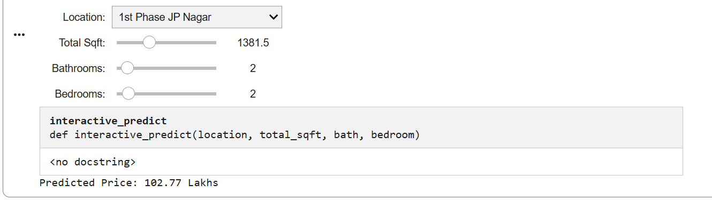
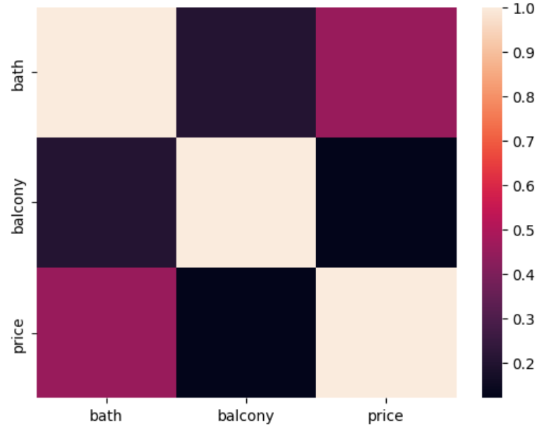
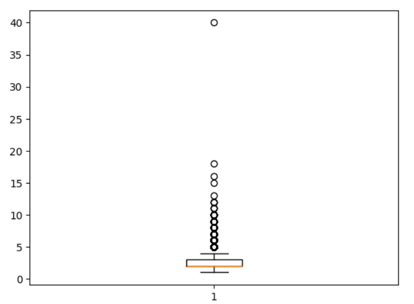
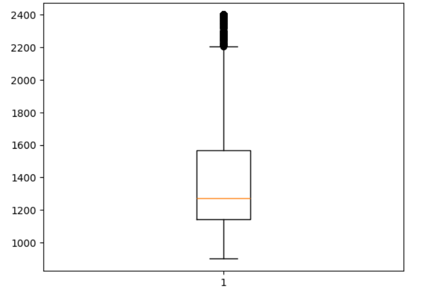
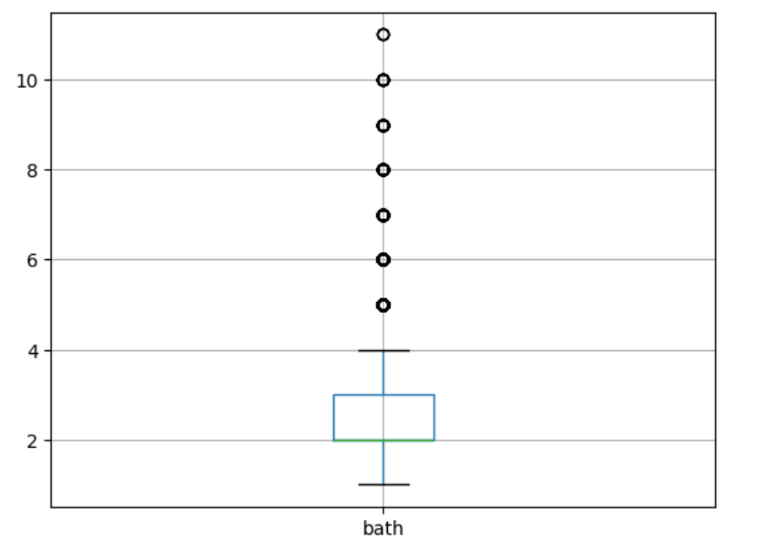
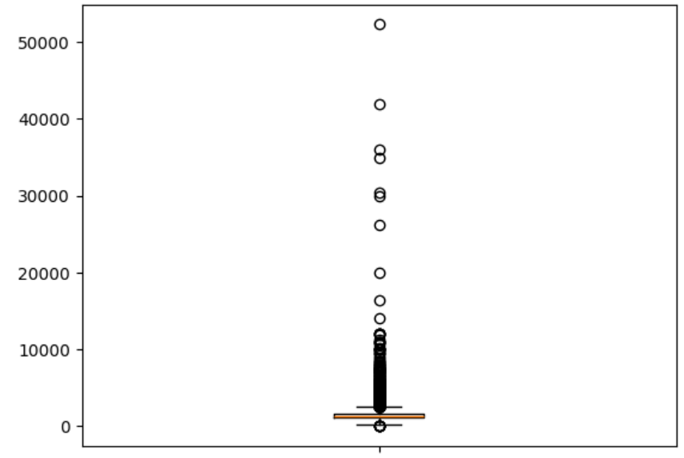
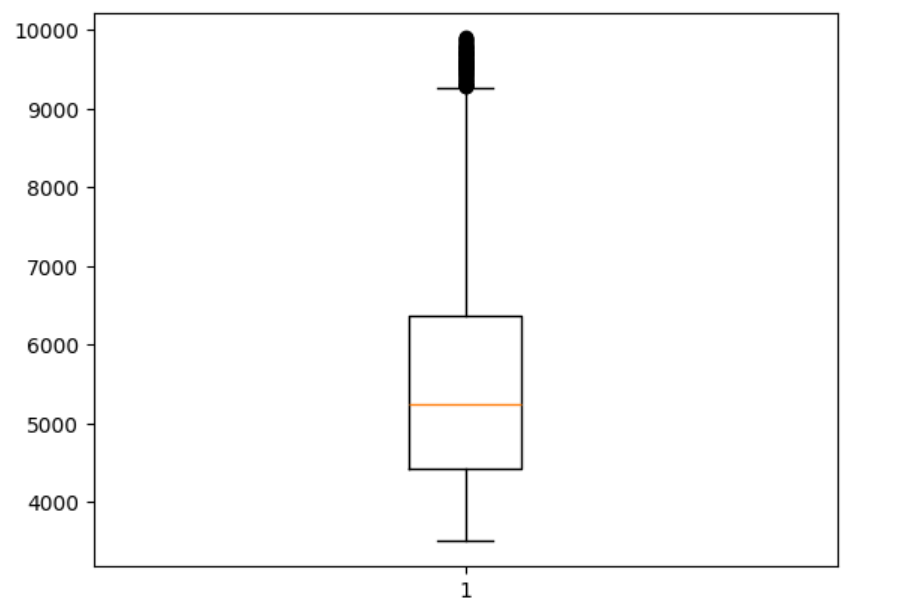

<div align="center">

# Bengaluru House Price Prediction

### Exploratory Data Analysis & Machine Learning using Python

<p>


</p>

<p>


</p>

---

**An end-to-end Machine Learning project that analyzes Bengaluru housing prices, performs Exploratory Data Analysis (EDA), handles data preprocessing, detects outliers, and predicts house prices using an interactive prediction widget.**

</div>

---
# Table of Contents

- [Project Overview](#project-overview)
- [Dataset Information](#dataset-information)
- [Technology Stack](#technology-stack)
- [Project Workflow](#project-workflow)
- [Interactive Prediction Widget](#interactive-prediction-widget)
- [Exploratory Data Analysis](#exploratory-data-analysis)
- [Key Insights](#key-insights)
- [Repository Structure](#repository-structure)
- [Installation](#installation)
- [Future Improvements](#future-improvements)
- [Author](#author)

---
# 📖 Project Overview

Real estate pricing depends on multiple factors such as location, total square footage, number of bedrooms, bathrooms, and property characteristics.

This project focuses on analyzing the Bengaluru House Price Dataset using Python. The workflow includes data cleaning, feature engineering, exploratory data analysis (EDA), outlier detection, and the development of a Machine Learning regression model capable of predicting house prices.

An interactive prediction widget was also implemented, allowing users to estimate house prices by selecting property details in real time.

---
# Dataset Information

| Attribute | Details |
|------------|----------|
| **Dataset Name** | Bengaluru House Price Dataset |
| **Domain** | Real Estate |
| **Source** | Kaggle |
| **File Format** | CSV |
| **Programming Language** | Python |
| **Development Environment** | Google Colab |

### Dataset Features

The dataset contains information about residential properties in Bengaluru, including:

- Area Type
- Availability
- Location
- Size (BHK)
- Society
- Total Square Feet
- Bathrooms
- Balcony

# 💻 Technology Stack

| Technology | Purpose |
|------------|---------|
| 🐍 Python | Programming Language |
| 🐼 Pandas | Data Cleaning & Manipulation |
| 🔢 NumPy | Numerical Computation |
| 📊 Matplotlib | Data Visualization |
| 📈 Seaborn | Statistical Visualization |
| 🤖 Scikit-Learn | Machine Learning Model |
| 📓 Google Colab | Development Environment |
| 🎛️ ipywidgets | Interactive Price Prediction Widget |

---

### Libraries Used

```python
pandas
numpy
matplotlib
seaborn
scikit-learn
ipywidgets
```
---
- Price

The dataset was cleaned and preprocessed before performing Exploratory Data Analysis and building the prediction model.

---
# 💻 Technology Stack

| Technology | Purpose |
|------------|---------|
| 🐍 Python | Programming Language |
| 🐼 Pandas | Data Cleaning & Manipulation |
| 🔢 NumPy | Numerical Computation |
| 📊 Matplotlib | Data Visualization |
| 📈 Seaborn | Statistical Visualization |
| 🤖 Scikit-Learn | Machine Learning Model |
| 📓 Google Colab | Development Environment |
| 🎛️ ipywidgets | Interactive Price Prediction Widget |

---

### Libraries Used

```python
pandas
numpy
matplotlib
seaborn
scikit-learn
ipywidgets
```

---
# 🔄 Project Workflow

```text
                Bengaluru House Price Dataset
                             │
                             ▼
                     Data Understanding
                             │
                             ▼
                    Data Cleaning & Preprocessing
                             │
                             ▼
                   Missing Value Treatment
                             │
                             ▼
                     Feature Engineering
                             │
                             ▼
                 Exploratory Data Analysis
                             │
                             ▼
                     Outlier Detection
                             │
                             ▼
               Machine Learning Model Training
                             │
                             ▼
               Interactive House Price Prediction
```

---
# Interactive Price Prediction Widget

One of the key highlights of this project is the interactive prediction interface developed using **ipywidgets**.

Users can estimate the price of a house by selecting:

- Location
- Total Square Feet
- Number of Bathrooms
- Number of Bedrooms

The trained Machine Learning model instantly predicts the estimated property price.

<p align="center">

</p>

---
# Exploratory Data Analysis

The dataset was explored using statistical techniques and visualizations to understand distributions, detect anomalies, and identify relationships among important features.

## Correlation Heatmap

<p align="center">

</p>

---

## Price Distribution

<p align="center">

</p>

---

## Total Square Feet Distribution

<p align="center">

</p>

---

## Bathroom Distribution

<p align="center">

</p>

---

## Bedroom Distribution

<p align="center">

</p>

---

## Price per Sqft Distribution

<p align="center">

</p>

---
# 📈 Key Insights

After performing data cleaning, exploratory analysis, and model development, the following insights were observed:

- 📍 **Location** is one of the most influential factors affecting house prices.
- 📐 Properties with larger **Total Square Feet** generally command higher prices.
- 🛏️ Houses with more bedrooms and bathrooms tend to have higher market values.
- 📊 Several **outliers** were detected in price and area-related features and handled during preprocessing.
- 🔍 Correlation analysis helped identify relationships between important numerical features.
- 🤖 An interactive Machine Learning model was successfully developed to estimate house prices based on user-selected inputs.

---

# 📂 Repository Structure

```text
Bengaluru-House-Price-Prediction
│
├── README.md
├── Bengaluru_House_Price_Analysis.ipynb
├── Bengaluru_House_Data.csv
│
├── images
│   ├── widget_demo.png
│   ├── correlation_heatmap.png
│   ├── price_distribution.png
│   ├── sqft_distribution.png
│   ├── bathroom_distribution.png
│   ├── bedroom_distribution.png
│   └── price_per_sqft_distribution.png
│
├── requirements.txt
└── LICENSE
```

---

# ⚙️ Installation

Clone the repository

```bash
git clone https://github.com/databydiksha/Bengaluru-House-Price-Prediction.git
```

Move into the project directory

```bash
cd Bengaluru-House-Price-Prediction
```

Install the required libraries

```bash
pip install -r requirements.txt
```

Launch Jupyter Notebook

```bash
jupyter notebook
```

Open

```text
Bengaluru_House_Price_Analysis.ipynb
```

Run all cells to reproduce the complete analysis and predictions.

---

# Future Improvements

- Improve feature engineering techniques.
- Compare multiple regression algorithms.
- Perform hyperparameter tuning.
- Deploy the prediction model using Streamlit or Flask.
- Integrate the project with a SQL database.
- Create a Power BI dashboard for interactive analytics.

---

# Skills Demonstrated

This project demonstrates practical knowledge of:

- Data Cleaning
- Data Preprocessing
- Exploratory Data Analysis (EDA)
- Data Visualization
- Feature Engineering
- Machine Learning
- Model Evaluation
- Interactive Widgets
- Python Programming

---

# License

This project is licensed under the **MIT License**.

---

# Author

## Diksha Pandey

Computer Science Student

Aspiring Data Analyst

### Connect with me

- GitHub: https://github.com/databydiksha
- LinkedIn: *(Add your LinkedIn profile here)*

---

<div align="center">

## ⭐ If you found this project useful, consider giving it a Star!

Thank you for visiting this repository.

</div>
